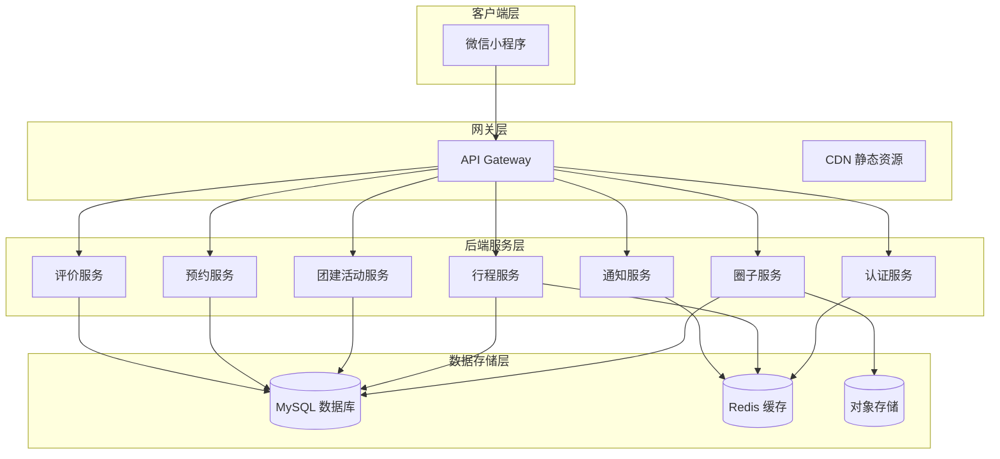

# 项目架构

## 整体架构



## 技术栈

### 后端
- **框架**: NestJS 10.x
- **语言**: TypeScript 5.x
- **数据库**: MySQL 8.0 / SQLite 3.x (开发)
- **缓存**: Redis 6.x
- **ORM**: TypeORM 0.3.x

### 前端
- **平台**: 微信小程序
- **语言**: TypeScript
- **UI 组件**: Vant Weapp
- **地图**: 腾讯地图 SDK

## 模块划分

| 模块 | 职责 | 关键功能 |
|------|------|---------|
| `auth` | 认证授权 | 微信登录、JWT 令牌 |
| `user` | 用户管理 | 用户资料、信用分 |
| `circle` | 圈子管理 | 创建圈子、成员审核 |
| `trip` | 行程管理 | 发布行程、搜索匹配 |
| `booking` | 预约管理 | 预约座位、确认/取消 |
| `event` | 团建活动 | 活动创建、智能分配 |
| `review` | 评价系统 | 星级评分、文字评价 |
| `notification` | 消息通知 | 推送通知、消息中心 |

## 目录结构

```
backend/
├── src/
│   ├── main.ts              # 应用入口
│   ├── app.module.ts        # 根模块
│   ├── modules/             # 业务模块
│   │   ├── auth/            # 认证模块
│   │   ├── user/            # 用户模块
│   │   ├── circle/          # 圈子模块
│   │   ├── trip/            # 行程模块
│   │   ├── booking/         # 预约模块
│   │   ├── event/           # 活动模块
│   │   ├── review/          # 评价模块
│   │   └── notification/    # 通知模块
│   ├── common/              # 公共模块
│   │   ├── decorators/      # 自定义装饰器
│   │   ├── filters/         # 异常过滤器
│   │   ├── guards/          # JWT 守卫
│   │   ├── interceptors/    # 拦截器
│   │   └── utils/           # 工具函数
│   └── config/              # 配置文件
│       ├── database.ts      # 数据库配置
│       └── env.ts           # 环境变量
├── test/                    # 测试文件
└── package.json
```

## 核心业务流程

### 1. 用户加入圈子

```
用户 → 搜索/创建圈子 → 申请加入 → 圈主审核 → 成为成员
```

### 2. 发布行程

```
车主 → 填写行程信息 → 选择费用模式 → 发布 → 圈内可见
```

### 3. 预约搭乘

```
乘客 → 搜索行程 → 提交预约 → 车主确认 (免费自动确认) → 锁定座位
```

### 4. 团建活动分配

```
组织者 → 创建活动 → 成员报名 (车主/搭车) → 智能分配 → 输出结果
```

## 数据一致性保障

- **事务管理**: 使用 TypeORM 的 `@Transaction()` 装饰器
- **乐观锁**: 版本号控制并发更新
- **分布式锁**: Redis 锁处理并发预约
- **事件驱动**: 使用 NestJS 的 EventEmitter 解耦模块

## 安全机制

- **JWT 认证**: 所有 API 需验证 token
- **权限控制**: 圈主/管理员/普通成员角色区分
- **数据隔离**: 圈子数据仅成员可见
- **敏感操作**: 取消、删除需二次验证

## 性能优化

- **缓存策略**: 热点数据 (圈子列表、行程列表) 使用 Redis
- **分页查询**: 所有列表接口支持分页
- **索引优化**: 常用查询字段建立索引
- **慢查询监控**: 记录执行时间>100ms 的查询
