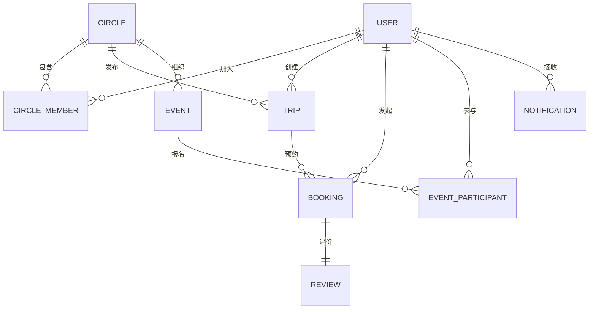

# 数据模型

## 实体关系图



## 数据表详细设计

### User (用户表)

存储用户基本信息和信用分。

```sql
CREATE TABLE user (
  id BIGINT PRIMARY KEY AUTO_INCREMENT,
  openid VARCHAR(64) UNIQUE NOT NULL COMMENT '微信 openid',
  unionid VARCHAR(64) COMMENT '微信 unionid',
  nickname VARCHAR(64) COMMENT '昵称',
  avatar_url VARCHAR(512) COMMENT '头像 URL',
  phone VARCHAR(20) COMMENT '手机号',
  gender TINYINT DEFAULT 0 COMMENT '性别 0-未知 1-男 2-女',
  credit_score INT DEFAULT 100 COMMENT '信用分',
  created_at DATETIME DEFAULT CURRENT_TIMESTAMP,
  updated_at DATETIME DEFAULT CURRENT_TIMESTAMP ON UPDATE CURRENT_TIMESTAMP,
  INDEX idx_openid (openid),
  INDEX idx_credit (credit_score)
) ENGINE=InnoDB DEFAULT CHARSET=utf8mb4 COMMENT='用户表';
```

### Circle (圈子表)

圈子基本信息。

```sql
CREATE TABLE circle (
  id BIGINT PRIMARY KEY AUTO_INCREMENT,
  name VARCHAR(128) NOT NULL COMMENT '圈子名称',
  type TINYINT NOT NULL COMMENT '类型 1-企业通勤 2-小区邻居 3-校友群 4-团建活动 5-其他',
  description VARCHAR(512) COMMENT '圈子简介',
  cover_image VARCHAR(512) COMMENT '封面图片',
  owner_id BIGINT NOT NULL COMMENT '圈主 ID',
  member_count INT DEFAULT 1 COMMENT '成员数量',
  max_members INT DEFAULT 500 COMMENT '最大成员数',
  is_public TINYINT DEFAULT 1 COMMENT '可见性 1-公开 2-私密',
  status TINYINT DEFAULT 1 COMMENT '状态 1-正常 2-禁用',
  created_at DATETIME DEFAULT CURRENT_TIMESTAMP,
  updated_at DATETIME DEFAULT CURRENT_TIMESTAMP ON UPDATE CURRENT_TIMESTAMP,
  INDEX idx_owner (owner_id),
  INDEX idx_type (type),
  INDEX idx_status (status)
) ENGINE=InnoDB DEFAULT CHARSET=utf8mb4 COMMENT='圈子表';
```

### CircleMember (圈子成员表)

用户与圈子的关联关系。

```sql
CREATE TABLE circle_member (
  id BIGINT PRIMARY KEY AUTO_INCREMENT,
  circle_id BIGINT NOT NULL COMMENT '圈子 ID',
  user_id BIGINT NOT NULL COMMENT '用户 ID',
  role TINYINT DEFAULT 3 COMMENT '角色 1-圈主 2-管理员 3-普通成员',
  status TINYINT DEFAULT 1 COMMENT '状态 1-正常 2-已离开 3-已禁用',
  remark VARCHAR(256) COMMENT '备注 (圈主可见)',
  joined_at DATETIME DEFAULT CURRENT_TIMESTAMP COMMENT '加入时间',
  UNIQUE KEY uk_circle_user (circle_id, user_id),
  INDEX idx_user (user_id),
  INDEX idx_status (status)
) ENGINE=InnoDB DEFAULT CHARSET=utf8mb4 COMMENT='圈子成员表';
```

### Trip (行程表)

车主发布的行程信息。

```sql
CREATE TABLE trip (
  id BIGINT PRIMARY KEY AUTO_INCREMENT,
  circle_id BIGINT NOT NULL COMMENT '圈子 ID',
  driver_id BIGINT NOT NULL COMMENT '车主 ID',
  start_address VARCHAR(256) NOT NULL COMMENT '起点地址',
  start_latitude DECIMAL(10,8) NOT NULL COMMENT '起点纬度',
  start_longitude DECIMAL(11,8) NOT NULL COMMENT '起点经度',
  end_address VARCHAR(256) NOT NULL COMMENT '终点地址',
  end_latitude DECIMAL(10,8) NOT NULL COMMENT '终点纬度',
  end_longitude DECIMAL(11,8) NOT NULL COMMENT '终点经度',
  departure_time DATETIME NOT NULL COMMENT '出发时间',
  seat_count TINYINT NOT NULL COMMENT '总座位数',
  available_seats TINYINT NOT NULL COMMENT '剩余座位',
  fee_mode TINYINT DEFAULT 1 COMMENT '费用模式 1-免费 2-AA 3-付费',
  fee_amount DECIMAL(10,2) COMMENT '费用金额',
  status TINYINT DEFAULT 1 COMMENT '状态 1-招募 2-已满 3-进行中 4-完成 5-取消',
  remark VARCHAR(512) COMMENT '备注',
  created_at DATETIME DEFAULT CURRENT_TIMESTAMP,
  updated_at DATETIME DEFAULT CURRENT_TIMESTAMP ON UPDATE CURRENT_TIMESTAMP,
  INDEX idx_circle (circle_id),
  INDEX idx_driver (driver_id),
  INDEX idx_status (status),
  INDEX idx_departure (departure_time)
) ENGINE=InnoDB DEFAULT CHARSET=utf8mb4 COMMENT='行程表';
```

### Booking (预约表)

乘客预约记录。

```sql
CREATE TABLE booking (
  id BIGINT PRIMARY KEY AUTO_INCREMENT,
  trip_id BIGINT NOT NULL COMMENT '行程 ID',
  driver_id BIGINT NOT NULL COMMENT '车主 ID',
  passenger_id BIGINT NOT NULL COMMENT '乘客 ID',
  seats_booked TINYINT NOT NULL DEFAULT 1 COMMENT '预约座位数',
  fee_amount DECIMAL(10,2) COMMENT '应付金额',
  status TINYINT DEFAULT 0 COMMENT '状态 0-待确认 1-已确认 2-已完成 3-已取消 4-已拒绝 5-爽约',
  passenger_cancel_reason VARCHAR(256) COMMENT '乘客取消原因',
  driver_cancel_reason VARCHAR(256) COMMENT '车主取消原因',
  booked_at DATETIME DEFAULT CURRENT_TIMESTAMP COMMENT '预约时间',
  confirmed_at DATETIME COMMENT '确认时间',
  completed_at DATETIME COMMENT '完成时间',
  cancelled_at DATETIME COMMENT '取消时间',
  INDEX idx_trip (trip_id),
  INDEX idx_driver (driver_id),
  INDEX idx_passenger (passenger_id),
  INDEX idx_status (status)
) ENGINE=InnoDB DEFAULT CHARSET=utf8mb4 COMMENT='预约表';
```

### Event (团建活动表)

团建活动信息。

```sql
CREATE TABLE event (
  id BIGINT PRIMARY KEY AUTO_INCREMENT,
  circle_id BIGINT NOT NULL COMMENT '圈子 ID',
  organizer_id BIGINT NOT NULL COMMENT '组织者 ID',
  title VARCHAR(128) NOT NULL COMMENT '活动标题',
  description TEXT COMMENT '活动详情',
  location_address VARCHAR(256) NOT NULL COMMENT '活动地点',
  location_latitude DECIMAL(10,8) NOT NULL COMMENT '地点纬度',
  location_longitude DECIMAL(11,8) NOT NULL COMMENT '地点经度',
  start_time DATETIME NOT NULL COMMENT '开始时间',
  end_time DATETIME COMMENT '结束时间',
  registration_deadline DATETIME COMMENT '报名截止',
  total_participants INT DEFAULT 0 COMMENT '总参与人数',
  drivers_count INT DEFAULT 0 COMMENT '车主数量',
  passengers_count INT DEFAULT 0 COMMENT '搭车人数',
  allocation_status TINYINT DEFAULT 0 COMMENT '分配状态 0-未分配 1-已分配',
  created_at DATETIME DEFAULT CURRENT_TIMESTAMP,
  updated_at DATETIME DEFAULT CURRENT_TIMESTAMP ON UPDATE CURRENT_TIMESTAMP,
  INDEX idx_circle (circle_id),
  INDEX idx_organizer (organizer_id),
  INDEX idx_start_time (start_time)
) ENGINE=InnoDB DEFAULT CHARSET=utf8mb4 COMMENT='团建活动表';
```

### EventParticipant (活动参与者表)

活动报名和分配结果。

```sql
CREATE TABLE event_participant (
  id BIGINT PRIMARY KEY AUTO_INCREMENT,
  event_id BIGINT NOT NULL COMMENT '活动 ID',
  user_id BIGINT NOT NULL COMMENT '用户 ID',
  role TINYINT DEFAULT 2 COMMENT '角色 1-车主 2-搭车 3-自发前往',
  seats_offered TINYINT DEFAULT 0 COMMENT '提供座位数',
  vehicle_info VARCHAR(256) COMMENT '车辆信息',
  pickup_preference VARCHAR(256) COMMENT '上车点偏好',
  allocation_result TEXT COMMENT '分配结果 JSON',
  joined_at DATETIME DEFAULT CURRENT_TIMESTAMP,
  UNIQUE KEY uk_event_user (event_id, user_id),
  INDEX idx_user (user_id),
  INDEX idx_role (role)
) ENGINE=InnoDB DEFAULT CHARSET=utf8mb4 COMMENT='活动参与者表';
```

### Review (评价表)

用户评价记录。

```sql
CREATE TABLE review (
  id BIGINT PRIMARY KEY AUTO_INCREMENT,
  booking_id BIGINT UNIQUE NOT NULL COMMENT '预约 ID',
  reviewer_id BIGINT NOT NULL COMMENT '评价人 ID',
  reviewee_id BIGINT NOT NULL COMMENT '被评价人 ID',
  rating TINYINT NOT NULL COMMENT '评分 1-5 星',
  content VARCHAR(512) COMMENT '评价内容',
  reply_content VARCHAR(512) COMMENT '回复内容',
  reply_at DATETIME COMMENT '回复时间',
  is_anonymous TINYINT DEFAULT 0 COMMENT '是否匿名',
  status TINYINT DEFAULT 1 COMMENT '状态 1-正常 2-隐藏 3-待审核',
  created_at DATETIME DEFAULT CURRENT_TIMESTAMP,
  INDEX idx_reviewer (reviewer_id),
  INDEX idx_reviewee (reviewee_id),
  INDEX idx_booking (booking_id)
) ENGINE=InnoDB DEFAULT CHARSET=utf8mb4 COMMENT='评价表';
```

### Notification (通知表)

系统通知。

```sql
CREATE TABLE notification (
  id BIGINT PRIMARY KEY AUTO_INCREMENT,
  user_id BIGINT NOT NULL COMMENT '用户 ID',
  type TINYINT NOT NULL COMMENT '类型 1-预约 2-圈子 3-行程 4-活动 5-系统',
  title VARCHAR(128) NOT NULL COMMENT '标题',
  content VARCHAR(512) NOT NULL COMMENT '内容',
  related_id BIGINT COMMENT '关联 ID',
  is_read TINYINT DEFAULT 0 COMMENT '是否已读',
  created_at DATETIME DEFAULT CURRENT_TIMESTAMP,
  INDEX idx_user (user_id),
  INDEX idx_read (is_read),
  INDEX idx_type (type)
) ENGINE=InnoDB DEFAULT CHARSET=utf8mb4 COMMENT='通知表';
```

## 枚举值说明

### Circle.type (圈子类型)
| 值 | 说明 |
|---|------|
| 1 | 企业通勤 |
| 2 | 小区邻居 |
| 3 | 校友群 |
| 4 | 团建活动 |
| 5 | 其他 |

### Trip.fee_mode (费用模式)
| 值 | 说明 |
|---|------|
| 1 | 免费互助 |
| 2 | AA 分摊 |
| 3 | 付费搭乘 |

### Booking.status (预约状态)
| 值 | 说明 |
|---|------|
| 0 | 待确认 |
| 1 | 已确认 |
| 2 | 已完成 |
| 3 | 已取消 |
| 4 | 已拒绝 |
| 5 | 已爽约 |

### Event.role (活动角色)
| 值 | 说明 |
|---|------|
| 1 | 车主 |
| 2 | 搭车 |
| 3 | 自发前往 |
