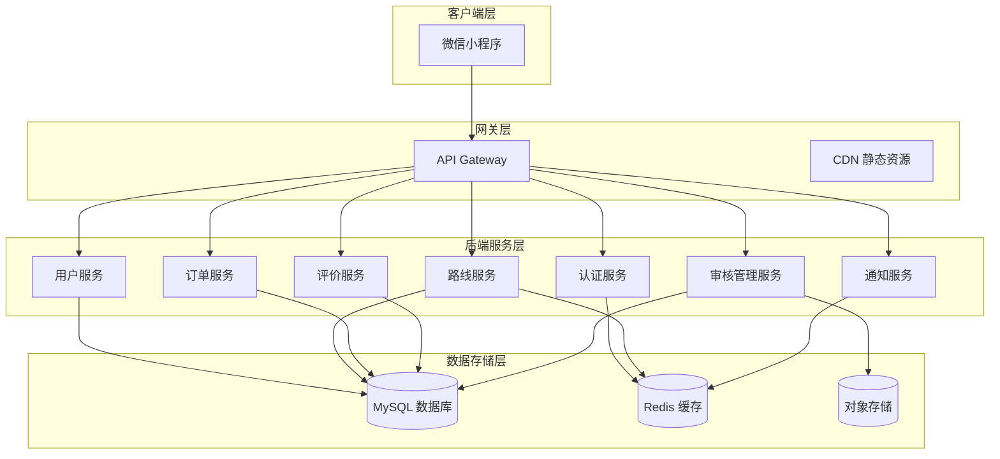
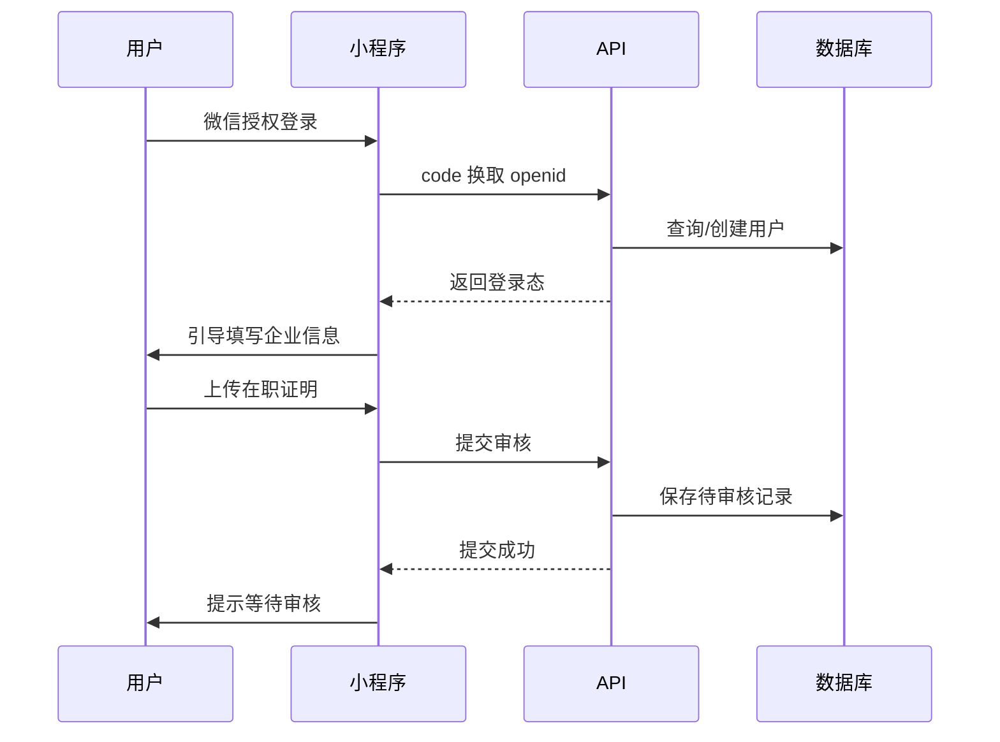
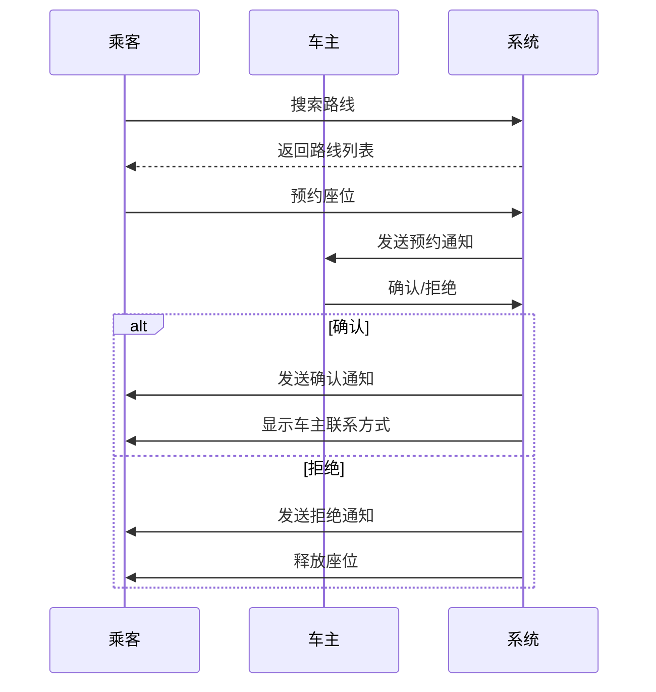
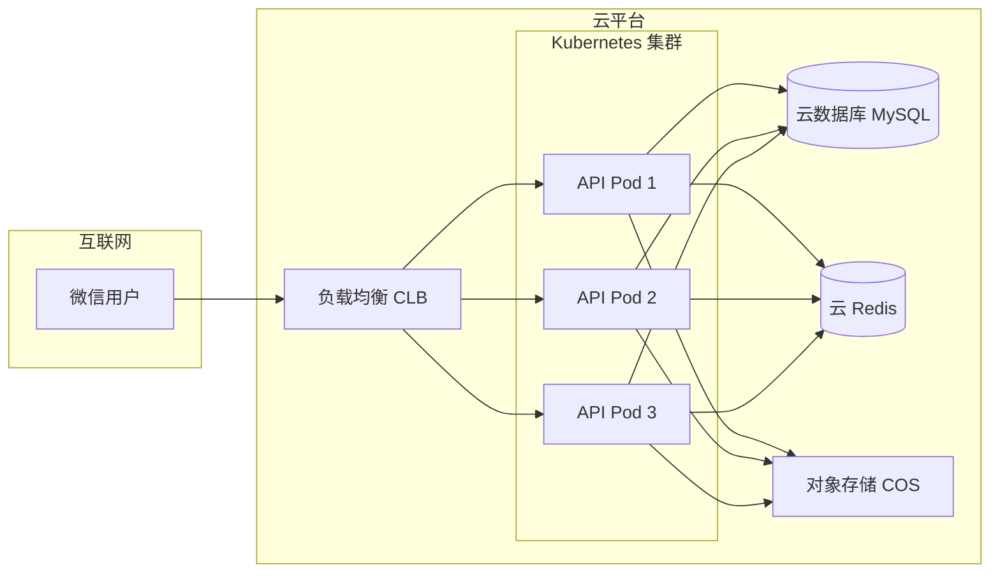

# 企业顺风车平台技术设计

Feature Name: carpool-platform
Updated: 2026-05-09

## Description

基于微信小程序的企业顺风车平台，支持多企业用户（企业名称相同即视为同公司），用户自行入驻并上传在职证明审核。系统部署在云端，目标服务 1000 人规模。

## Architecture



## 技术栈选型

### 前端 (微信小程序)
- **框架**: 原生微信小程序 + TypeScript
- **UI 组件库**: Vant Weapp
- **地图服务**: 腾讯地图小程序 SDK
- **状态管理**: Mobx-miniprogram

### 后端
- **运行环境**: Node.js 18+
- **框架**: NestJS (TypeScript)
- **API 风格**: RESTful API
- **认证**: JWT + 微信小程序登录

### 数据库
- **主数据库**: MySQL 8.0 (云数据库)
- **缓存**: Redis 6.0 (云缓存)
- **对象存储**: 腾讯云 COS / 阿里云 OSS

### 基础设施
- **云服务**: 腾讯云 / 阿里云
- **容器化**: Docker + Kubernetes
- **CI/CD**: GitHub Actions / 云效
- **监控**: Prometheus + Grafana

## 数据模型

### User (用户表)
```sql
CREATE TABLE user (
  id BIGINT PRIMARY KEY AUTO_INCREMENT,
  openid VARCHAR(64) UNIQUE NOT NULL,
  unionid VARCHAR(64),
  nickname VARCHAR(64),
  avatar_url VARCHAR(512),
  phone VARCHAR(20),
  gender TINYINT DEFAULT 0,
  created_at DATETIME DEFAULT CURRENT_TIMESTAMP,
  updated_at DATETIME DEFAULT CURRENT_TIMESTAMP ON UPDATE CURRENT_TIMESTAMP,
  INDEX idx_openid (openid)
);
```

### Company (企业表)
```sql
CREATE TABLE company (
  id BIGINT PRIMARY KEY AUTO_INCREMENT,
  name VARCHAR(128) UNIQUE NOT NULL,
  full_name VARCHAR(256),
  domain VARCHAR(128),
  status TINYINT DEFAULT 1 COMMENT '1-正常 2-禁用',
  created_at DATETIME DEFAULT CURRENT_TIMESTAMP,
  INDEX idx_name (name)
);
```

### UserCompany (用户企业关联表)
```sql
CREATE TABLE user_company (
  id BIGINT PRIMARY KEY AUTO_INCREMENT,
  user_id BIGINT NOT NULL,
  company_id BIGINT NOT NULL,
  employee_id VARCHAR(64),
  certificate_url VARCHAR(512) NOT NULL,
  audit_status TINYINT DEFAULT 0 COMMENT '0-待审核 1-通过 2-拒绝',
  audit_remark VARCHAR(256),
  audited_at DATETIME,
  created_at DATETIME DEFAULT CURRENT_TIMESTAMP,
  UNIQUE KEY uk_user_company (user_id, company_id),
  INDEX idx_company (company_id),
  INDEX idx_audit (audit_status)
);
```

### Route (路线表)
```sql
CREATE TABLE route (
  id BIGINT PRIMARY KEY AUTO_INCREMENT,
  driver_id BIGINT NOT NULL,
  company_id BIGINT,
  start_address VARCHAR(256) NOT NULL,
  start_latitude DECIMAL(10, 8) NOT NULL,
  start_longitude DECIMAL(11, 8) NOT NULL,
  end_address VARCHAR(256) NOT NULL,
  end_latitude DECIMAL(10, 8) NOT NULL,
  end_longitude DECIMAL(11, 8) NOT NULL,
  departure_time TIME NOT NULL,
  seat_count TINYINT NOT NULL,
  available_seats TINYINT NOT NULL,
  price_per_seat DECIMAL(10, 2),
  frequency VARCHAR(16) COMMENT '工作日/每天/自定义',
  status TINYINT DEFAULT 1 COMMENT '1-有效 2-无效 3-已满',
  publish_date DATE NOT NULL,
  created_at DATETIME DEFAULT CURRENT_TIMESTAMP,
  updated_at DATETIME DEFAULT CURRENT_TIMESTAMP ON UPDATE CURRENT_TIMESTAMP,
  INDEX idx_driver (driver_id),
  INDEX idx_company (company_id),
  INDEX idx_status (status),
  INDEX idx_publish (publish_date)
);
```

### Order (订单表)
```sql
CREATE TABLE `order` (
  id BIGINT PRIMARY KEY AUTO_INCREMENT,
  order_no VARCHAR(32) UNIQUE NOT NULL,
  route_id BIGINT NOT NULL,
  driver_id BIGINT NOT NULL,
  passenger_id BIGINT NOT NULL,
  company_id BIGINT,
  pickup_address VARCHAR(256),
  dropoff_address VARCHAR(256),
  seats_booked TINYINT NOT NULL,
  total_amount DECIMAL(10, 2),
  status TINYINT DEFAULT 0 COMMENT '0-待确认 1-已确认 2-已完成 3-已取消 4-已拒绝 5-已爽约',
  passenger_cancel_reason VARCHAR(256),
  driver_cancel_reason VARCHAR(256),
  booked_at DATETIME DEFAULT CURRENT_TIMESTAMP,
  confirmed_at DATETIME,
  completed_at DATETIME,
  cancelled_at DATETIME,
  INDEX idx_route (route_id),
  INDEX idx_driver (driver_id),
  INDEX idx_passenger (passenger_id),
  INDEX idx_status (status),
  INDEX idx_company (company_id)
);
```

### Review (评价表)
```sql
CREATE TABLE review (
  id BIGINT PRIMARY KEY AUTO_INCREMENT,
  order_id BIGINT UNIQUE NOT NULL,
  reviewer_id BIGINT NOT NULL,
  reviewee_id BIGINT NOT NULL,
  rating TINYINT NOT NULL COMMENT '1-5 星',
  content VARCHAR(512),
  reply_content VARCHAR(512),
  reply_at DATETIME,
  is_anonymous TINYINT DEFAULT 0,
  status TINYINT DEFAULT 1 COMMENT '1-正常 2-隐藏 3-待审核',
  created_at DATETIME DEFAULT CURRENT_TIMESTAMP,
  INDEX idx_reviewer (reviewer_id),
  INDEX idx_reviewee (reviewee_id),
  INDEX idx_order (order_id)
);
```

### Notification (通知表)
```sql
CREATE TABLE notification (
  id BIGINT PRIMARY KEY AUTO_INCREMENT,
  user_id BIGINT NOT NULL,
  type TINYINT NOT NULL COMMENT '1-订单通知 2-系统通知 3-审核通知',
  title VARCHAR(128) NOT NULL,
  content VARCHAR(512) NOT NULL,
  related_id BIGINT,
  is_read TINYINT DEFAULT 0,
  created_at DATETIME DEFAULT CURRENT_TIMESTAMP,
  INDEX idx_user (user_id),
  INDEX idx_read (is_read)
);
```

## 核心接口设计

### 认证模块
```
POST /api/auth/wechat-login     # 微信登录
POST /api/auth/logout           # 登出
GET  /api/auth/profile          # 获取用户信息
```

### 企业模块
```
POST /api/company/submit        # 提交企业信息
GET  /api/company/search        # 搜索企业
GET  /api/company/detail/:id    # 企业详情
GET  /api/company/members       # 企业成员列表
```

### 路线模块
```
POST /api/route                 # 发布路线
PUT  /api/route/:id             # 更新路线
DELETE /api/route/:id           # 删除路线
GET  /api/route/list            # 路线列表 (支持搜索筛选)
GET  /api/route/:id             # 路线详情
GET  /api/route/my              # 我的路线
```

### 订单模块
```
POST /api/order                 # 创建预约
PUT  /api/order/:id/confirm     # 确认订单
PUT  /api/order/:id/cancel      # 取消订单
GET  /api/order/list            # 订单列表
GET  /api/order/:id             # 订单详情
GET  /api/order/my              # 我的订单
```

### 评价模块
```
POST /api/review                # 提交评价
GET  /api/review/list           # 评价列表
GET  /api/review/user/:id       # 用户评价统计
```

### 审核管理模块
```
GET  /api/admin/certificates    # 待审核在职证明列表
PUT  /api/admin/certificate/:id # 审核在职证明
GET  /api/admin/users           # 用户管理
PUT  /api/admin/user/:id/status # 用户状态管理
```

## 关键业务流程

### 1. 用户入驻流程


### 2. 预约乘车流程


## 正确性属性

### 数据一致性
- 订单状态变更必须使用事务保证原子性
- 座位数扣减必须加锁防止超卖
- 评价必须基于已完成的订单

### 并发控制
- 使用 Redis 分布式锁处理并发预约
- 使用数据库乐观锁处理路线更新
- 热点数据（如路线列表）使用缓存

### 安全约束
- 所有 API 必须验证 JWT token
- 敏感操作（取消订单、删除路线）需二次验证
- 在职证明图片需添加水印防止滥用

## 错误处理

### 错误码规范
```typescript
enum ErrorCode {
  // 通用错误
  SUCCESS = 0,
  SYSTEM_ERROR = 1000,
  PARAM_ERROR = 1001,
  UNAUTHORIZED = 1002,
  
  // 认证错误
  WECHAT_LOGIN_FAILED = 2001,
  TOKEN_EXPIRED = 2002,
  
  // 审核错误
  CERTIFICATE_PENDING = 3001,
  CERTIFICATE_REJECTED = 3002,
  
  // 路线错误
  ROUTE_NOT_FOUND = 4001,
  ROUTE_FULL = 4002,
  ROUTE_EXPIRED = 4003,
  
  // 订单错误
  ORDER_NOT_FOUND = 5001,
  ORDER_STATUS_INVALID = 5002,
  ORDER_CANNOT_CANCEL = 5003,
  
  // 企业错误
  COMPANY_NOT_FOUND = 6001,
  COMPANY_ALREADY_JOINED = 6002
}
```

### 异常处理策略
- 业务异常：返回友好提示，记录日志
- 系统异常：降级处理，发送告警
- 网络超时：指数退避重试（最多 3 次）

## 测试策略

### 单元测试
- 服务层逻辑覆盖率达到 80%
- 关键业务逻辑（预约、取消、评价）100% 覆盖
- 使用 Jest 进行测试

### 集成测试
- API 接口测试（Postman / ApiFox）
- 数据库事务测试
- 缓存一致性测试

### 端到端测试
- 小程序核心流程自动化测试
- 使用微信小程序测试工具

### 性能测试
- 并发预约场景压测（目标：支持 100 并发）
- 接口响应时间 P95 < 200ms
- 数据库慢查询监控

## 部署架构



## 监控与告警

### 关键指标
- API 请求量和响应时间
- 错误率和错误类型分布
- 数据库连接数和慢查询
- Redis 命中率和内存使用
- 小程序启动时间和页面加载时间

### 告警策略
- 错误率 > 1% 持续 5 分钟触发告警
- P95 响应时间 > 500ms 触发告警
- 数据库 CPU > 80% 触发告警
- 服务实例宕机立即告警

## 参考文献

[^1]: (微信小程序开发文档) - [官方文档](https://developers.weixin.qq.com/miniprogram/dev/framework/)
[^2]: (NestJS 官方文档) - [框架文档](https://docs.nestjs.com/)
[^3]: (腾讯云云开发文档) - [部署指南](https://cloud.tencent.com/document/product/876)
