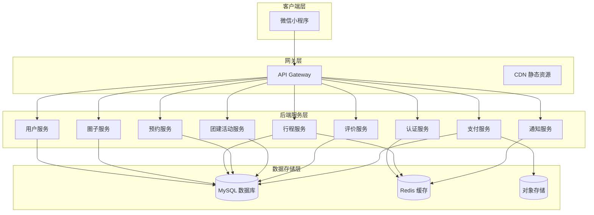

# 蹭蹭车技术设计

Feature Name: ceng-carpool
Updated: 2026-06-01

## Description

基于微信小程序的熟人社交蹭车平台，支持企业内上下班拼车、团建出行车辆分配、社群（小区/校友）蹭车等多种场景。采用圈子机制，用户自发组织和管理。支持免费互助、AA 制分摊、付费搭乘三种费用模式。

## Architecture



## 技术栈选型

### 前端 (微信小程序)
- **框架**: 原生微信小程序 + TypeScript
- **UI 组件库**: Vant Weapp
- **地图服务**: 腾讯地图小程序 SDK
- **状态管理**: Mobx-miniprogram

### 后端
- **运行环境**: Node.js 18+
- **框架**: NestJS (TypeScript)
- **API 风格**: RESTful API
- **认证**: JWT + 微信小程序登录

### 数据库
- **主数据库**: MySQL 8.0 (云数据库)
- **缓存**: Redis 6.0 (云缓存)
- **对象存储**: 腾讯云 COS

## 数据模型

### User (用户表)
```sql
CREATE TABLE user (
  id BIGINT PRIMARY KEY AUTO_INCREMENT,
  openid VARCHAR(64) UNIQUE NOT NULL,
  unionid VARCHAR(64),
  nickname VARCHAR(64),
  avatar_url VARCHAR(512),
  phone VARCHAR(20),
  gender TINYINT DEFAULT 0,
  credit_score INT DEFAULT 100 COMMENT '信用分',
  created_at DATETIME DEFAULT CURRENT_TIMESTAMP,
  updated_at DATETIME DEFAULT CURRENT_TIMESTAMP ON UPDATE CURRENT_TIMESTAMP,
  INDEX idx_openid (openid)
);
```

### Circle (圈子表)
```sql
CREATE TABLE circle (
  id BIGINT PRIMARY KEY AUTO_INCREMENT,
  name VARCHAR(128) NOT NULL,
  type TINYINT NOT NULL COMMENT '1-企业通勤 2-小区邻居 3-校友群 4-团建活动 5-其他',
  description VARCHAR(512),
  owner_id BIGINT NOT NULL,
  member_count INT DEFAULT 1,
  is_public TINYINT DEFAULT 1 COMMENT '1-公开 2-私密',
  status TINYINT DEFAULT 1 COMMENT '1-正常 2-禁用',
  created_at DATETIME DEFAULT CURRENT_TIMESTAMP,
  INDEX idx_owner (owner_id),
  INDEX idx_type (type)
);
```

### CircleMember (圈子成员表)
```sql
CREATE TABLE circle_member (
  id BIGINT PRIMARY KEY AUTO_INCREMENT,
  circle_id BIGINT NOT NULL,
  user_id BIGINT NOT NULL,
  role TINYINT DEFAULT 2 COMMENT '1-圈主 2-管理员 3-普通成员',
  status TINYINT DEFAULT 1 COMMENT '1-正常 2-已离开 3-已禁用',
  joined_at DATETIME DEFAULT CURRENT_TIMESTAMP,
  UNIQUE KEY uk_circle_user (circle_id, user_id),
  INDEX idx_user (user_id)
);
```

### Trip (行程表)
```sql
CREATE TABLE trip (
  id BIGINT PRIMARY KEY AUTO_INCREMENT,
  circle_id BIGINT NOT NULL,
  driver_id BIGINT NOT NULL,
  start_address VARCHAR(256) NOT NULL,
  start_latitude DECIMAL(10,8) NOT NULL,
  start_longitude DECIMAL(11,8) NOT NULL,
  end_address VARCHAR(256) NOT NULL,
  end_latitude DECIMAL(10,8) NOT NULL,
  end_longitude DECIMAL(11,8) NOT NULL,
  departure_time DATETIME NOT NULL,
  seat_count TINYINT NOT NULL,
  available_seats TINYINT NOT NULL,
  fee_mode TINYINT DEFAULT 1 COMMENT '1-免费互助 2-AA 分摊 3-付费搭乘',
  fee_amount DECIMAL(10,2) COMMENT '分摊金额/价格',
  status TINYINT DEFAULT 1 COMMENT '1-招募中 2-已满 3-进行中 4-已完成 5-已取消',
  remark VARCHAR(512),
  created_at DATETIME DEFAULT CURRENT_TIMESTAMP,
  updated_at DATETIME DEFAULT CURRENT_TIMESTAMP ON UPDATE CURRENT_TIMESTAMP,
  INDEX idx_circle (circle_id),
  INDEX idx_driver (driver_id),
  INDEX idx_status (status),
  INDEX idx_departure (departure_time)
);
```

### Booking (预约表)
```sql
CREATE TABLE booking (
  id BIGINT PRIMARY KEY AUTO_INCREMENT,
  trip_id BIGINT NOT NULL,
  driver_id BIGINT NOT NULL,
  passenger_id BIGINT NOT NULL,
  seats_booked TINYINT NOT NULL,
  fee_amount DECIMAL(10,2),
  status TINYINT DEFAULT 0 COMMENT '0-待确认 1-已确认 2-已完成 3-已取消 4-已拒绝 5-已爽约',
  passenger_cancel_reason VARCHAR(256),
  driver_cancel_reason VARCHAR(256),
  booked_at DATETIME DEFAULT CURRENT_TIMESTAMP,
  confirmed_at DATETIME,
  completed_at DATETIME,
  INDEX idx_trip (trip_id),
  INDEX idx_driver (driver_id),
  INDEX idx_passenger (passenger_id),
  INDEX idx_status (status)
);
```

### Event (团建活动表)
```sql
CREATE TABLE event (
  id BIGINT PRIMARY KEY AUTO_INCREMENT,
  circle_id BIGINT NOT NULL,
  organizer_id BIGINT NOT NULL,
  title VARCHAR(128) NOT NULL,
  description TEXT,
  location_address VARCHAR(256) NOT NULL,
  location_latitude DECIMAL(10,8) NOT NULL,
  location_longitude DECIMAL(11,8) NOT NULL,
  start_time DATETIME NOT NULL,
  end_time DATETIME,
  total_participants INT DEFAULT 0,
  drivers_needed INT DEFAULT 0,
  allocation_status TINYINT DEFAULT 0 COMMENT '0-未分配 1-已分配',
  created_at DATETIME DEFAULT CURRENT_TIMESTAMP,
  INDEX idx_circle (circle_id),
  INDEX idx_organizer (organizer_id),
  INDEX idx_start_time (start_time)
);
```

### EventParticipant (活动参与者表)
```sql
CREATE TABLE event_participant (
  id BIGINT PRIMARY KEY AUTO_INCREMENT,
  event_id BIGINT NOT NULL,
  user_id BIGINT NOT NULL,
  role TINYINT DEFAULT 2 COMMENT '1-车主 2-搭车 3-自发前往',
  seats_offered TINYINT DEFAULT 0,
  vehicle_info VARCHAR(256),
  allocation_result TEXT COMMENT 'JSON 格式存储分配结果',
  joined_at DATETIME DEFAULT CURRENT_TIMESTAMP,
  UNIQUE KEY uk_event_user (event_id, user_id),
  INDEX idx_user (user_id),
  INDEX idx_role (role)
);
```

### Review (评价表)
```sql
CREATE TABLE review (
  id BIGINT PRIMARY KEY AUTO_INCREMENT,
  booking_id BIGINT UNIQUE NOT NULL,
  reviewer_id BIGINT NOT NULL,
  reviewee_id BIGINT NOT NULL,
  rating TINYINT NOT NULL COMMENT '1-5 星',
  content VARCHAR(512),
  reply_content VARCHAR(512),
  reply_at DATETIME,
  is_anonymous TINYINT DEFAULT 0,
  status TINYINT DEFAULT 1 COMMENT '1-正常 2-隐藏 3-待审核',
  created_at DATETIME DEFAULT CURRENT_TIMESTAMP,
  INDEX idx_reviewer (reviewer_id),
  INDEX idx_reviewee (reviewee_id),
  INDEX idx_booking (booking_id)
);
```

### Notification (通知表)
```sql
CREATE TABLE notification (
  id BIGINT PRIMARY KEY AUTO_INCREMENT,
  user_id BIGINT NOT NULL,
  type TINYINT NOT NULL COMMENT '1-预约通知 2-圈子申请 3-行程变更 4-活动提醒 5-系统通知',
  title VARCHAR(128) NOT NULL,
  content VARCHAR(512) NOT NULL,
  related_id BIGINT,
  is_read TINYINT DEFAULT 0,
  created_at DATETIME DEFAULT CURRENT_TIMESTAMP,
  INDEX idx_user (user_id),
  INDEX idx_read (is_read),
  INDEX idx_type (type)
);
```

## 核心接口设计

### 认证模块
```
POST /api/auth/wechat-login     # 微信登录
POST /api/auth/logout           # 登出
GET  /api/auth/profile          # 获取用户信息
```

### 圈子模块
```
POST /api/circle                # 创建圈子
PUT  /api/circle/:id            # 更新圈子
GET  /api/circle/list           # 我的圈子列表
GET  /api/circle/:id            # 圈子详情
GET  /api/circle/:id/members    # 成员列表
POST /api/circle/:id/join       # 申请加入
PUT  /api/circle/:id/members/:userId/status  # 审核成员申请
```

### 行程模块
```
POST /api/trip                  # 发布行程
PUT  /api/trip/:id              # 更新行程
DELETE /api/trip/:id            # 删除行程
GET  /api/trip/list             # 行程列表 (支持圈子、时间筛选)
GET  /api/trip/:id              # 行程详情
GET  /api/trip/my               # 我的行程
```

### 预约模块
```
POST /api/booking               # 创建预约
PUT  /api/booking/:id/confirm   # 确认预约
PUT  /api/booking/:id/cancel    # 取消预约
GET  /api/booking/list          # 预约列表
GET  /api/booking/:id           # 预约详情
```

### 团建活动模块
```
POST /api/event                 # 创建团建活动
PUT  /api/event/:id             # 更新活动
GET  /api/event/list            # 活动列表
GET  /api/event/:id/participants # 参与者列表
POST /api/event/:id/participants # 报名活动
POST /api/event/:id/allocate    # 智能分配车辆
GET  /api/event/:id/allocation  # 分配结果
```

### 评价模块
```
POST /api/review                # 提交评价
GET  /api/review/list           # 评价列表
GET  /api/review/user/:id       # 用户评价统计
```

## 关键业务逻辑

### 1. 团建活动智能分配算法

```typescript
interface AllocationResult {
  driver: User;
  passengers: User[];
  seatsUsed: number;
}

/**
 * 智能分配算法
 * 优先级：
 * 1. 同部门/同小组优先
 * 2. 上车地点相近优先
 * 3. 历史评价高优先
 * 4. 信用分高优先
 */
function allocateVehicles(
  drivers: EventParticipant[],
  passengers: EventParticipant[],
  event: Event
): AllocationResult[] {
  const results: AllocationResult[] = [];
  const unassigned: User[] = [];
  
  // 1. 按车主座位数分组
  for (const driver of drivers) {
    const availableSeats = driver.seatsOffered - 1; // 减去车主自己
    const passengersForThisDriver: User[] = [];
    
    // 2. 为每个车主分配乘客
    while (passengersForThisDriver.length < availableSeats && passengers.length > 0) {
      // 优先同部门
      const sameDept = passengers.find(p => p.department === driver.department);
      if (sameDept) {
        passengersForThisDriver.push(sameDept);
        passengers = passengers.filter(p => p.id !== sameDept.id);
        continue;
      }
      
      // 其次上车地点相近
      const nearest = findNearestPassenger(driver, passengers);
      if (nearest) {
        passengersForThisDriver.push(nearest);
        passengers = passengers.filter(p => p.id !== nearest.id);
      } else {
        break;
      }
    }
    
    results.push({
      driver: driver.user,
      passengers: passengersForThisDriver,
      seatsUsed: passengersForThisDriver.length
    });
  }
  
  // 3. 剩余乘客建议打车
  unassigned.push(...passengers);
  
  return {
    allocations: results,
    unassignedCount: unassigned.length,
    suggestedTaxis: Math.ceil(unassigned.length / 4) // 按每车 4 人计算
  };
}
```

### 2. AA 费用计算

```typescript
/**
 * 计算 AA 分摊费用
 * @param distance 行程距离 (公里)
 * @param fuelPrice 油价 (元/升)
 * @param fuelConsumption 车辆油耗 (升/百公里)
 * @param tollFee 过路费 (元)
 * @param seatsUsed 搭乘人数
 */
function calculateAAFee(
  distance: number,
  fuelPrice: number = 8.5,
  fuelConsumption: number = 8.0,
  tollFee: number = 0,
  seatsUsed: number
): { total: number; perPerson: number; breakdown: string } {
  const fuelCost = (distance * fuelConsumption / 100) * fuelPrice;
  const total = fuelCost + tollFee;
  const perPerson = total / (seatsUsed + 1); // +1 是车主本人
  
  return {
    total: Math.round(total * 100) / 100,
    perPerson: Math.round(perPerson * 100) / 100,
    breakdown: `油费¥${Math.round(fuelCost)} + 过路费¥${tollFee}`
  };
}
```

## 错误处理

### 错误码规范
```typescript
enum ErrorCode {
  // 通用错误
  SUCCESS = 0,
  SYSTEM_ERROR = 1000,
  PARAM_ERROR = 1001,
  UNAUTHORIZED = 1002,
  
  // 圈子错误
  CIRCLE_NOT_FOUND = 3001,
  CIRCLE_ALREADY_JOINED = 3002,
  CIRCLE_MEMBER_LIMIT = 3003,
  
  // 行程错误
  TRIP_NOT_FOUND = 4001,
  TRIP_FULL = 4002,
  TRIP_EXPIRED = 4003,
  
  // 预约错误
  BOOKING_NOT_FOUND = 5001,
  BOOKING_STATUS_INVALID = 5002,
  BOOKING_CANNOT_CANCEL = 5003,
  
  // 活动错误
  EVENT_NOT_FOUND = 6001,
  EVENT_ALREADY_JOINED = 6002,
  EVENT_ALLOCATION_FAILED = 6003
}
```

## 测试策略

### 单元测试
- 服务层逻辑覆盖率达到 80%
- 关键业务逻辑（预约、分配、评价）100% 覆盖
- 使用 Jest 进行测试

### 集成测试
- API 接口测试（Postman / ApiFox）
- 数据库事务测试
- 缓存一致性测试

### 端到端测试
- 小程序核心流程自动化测试
- 团建分配场景测试
- 使用微信小程序测试工具

## 部署架构

参考原设计架构，保持不变。

## 监控与告警

### 关键指标
- 圈子数量和活跃度
- 行程发布量和成单率
- 团建活动数量和分配成功率
- 用户信用分分布
- API 请求量和响应时间

### 告警策略
- 错误率 > 1% 持续 5 分钟触发告警
- P95 响应时间 > 500ms 触发告警
- 数据库 CPU > 80% 触发告警
- 服务实例宕机立即告警

## 参考文献

[^1]: (微信小程序开发文档) - [官方文档](https://developers.weixin.qq.com/miniprogram/dev/framework/)
[^2]: (NestJS 官方文档) - [框架文档](https://docs.nestjs.com/)
[^3]: (腾讯地图 API) - [地图服务](https://lbs.qq.com/)
